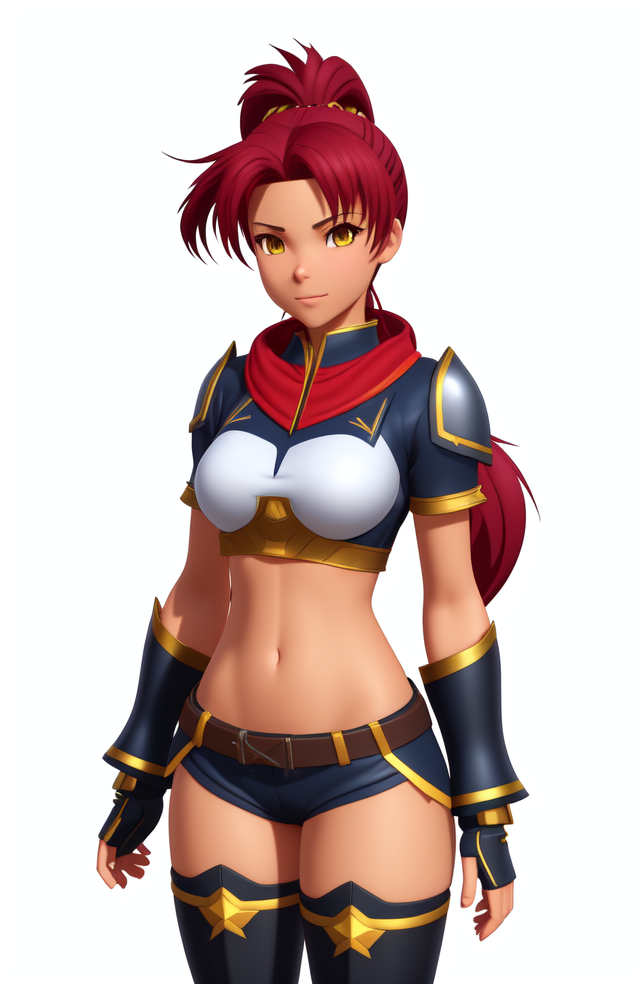

# Isekai Fantasy: Adventurer Guild CEO Simulator

[](https://nodejs.org/)
[](https://react.dev/)
[](https://vitejs.dev/)
[](https://www.typescriptlang.org/)
[](./LICENSE)

Run a fantasy Adventurer Guild as its CEO: recruit heroes, assign quests, manage inventory, survive battles, and grow your notoriety. Built with React + Vite, fully data‑driven via JSON catalogs.

<details>
  <summary><b>📸 Screenshots</b> (click to expand)</summary>

  <div align="center">
    
    
    
  </div>

  <sub>Note: portraits are used as in‑game avatars; UI screenshots vary by current build.</sub>
</details>

## Quickstart

First-time setup:

```bash
# install dependencies inside the app workspace
cd app && npm install
```

Run the dev server (pick one):

```bash
# A) From project root (wrapper script)
npm run dev
# → opens http://localhost:5174 (strict port)
```

```bash
# B) Directly inside the app workspace
cd app
npm install
npm run dev
```

Build and preview:

```bash
cd app
npm run build   # type-check + production build (Vite)
npm run preview # preview the production build locally
```

## Features

- 🔱 Guild management: Recruit weekly candidates, track upkeep, and grow your roster.
- 📜 Quests and missions: Procedurally generated contracts with ranks (H→S), expiry, rewards, and fame.
- ⚔️ Turn-based battles: Wave-based encounters triggered by certain quest types; use items and tactics.
- 🛒 Shop and economy: Data-driven items with categories, prices, stackability, and effects.
- 🎒 Inventory and equipment: Drag & drop, split stacks, equip bonuses, use items from guild or unit bags.
- 🍳 Kitchen and breakfast: Daily feeding loop to keep members ready; see who’s still hungry.
- 💾 Save/Load: Export/import saves as JSON files using the browser’s file picker.
- 🧭 Quality of life: Auto-assign, “Run all assigned”, “Next Day” floating action button, hash-based tabs.
- 🛠️ Admin tooling: Tileset preview/import/export, Items catalog view, Battle trigger.

## How to play (UX map)

- Header controls: toggle Auto‑assign, Save, Load, Reset.
- Tabs: `#dashboard`, `#guild`, `#recruitment`, `#quests`, `#shop`, `#guild-inventory`, `#events` and admin tabs.
- During battles: tabs are disabled and a modal overlay keeps combat front-and-center.
- Next Day: use the floating button; if adventurers are idle, choose to auto‑assign and proceed.

## Data‑driven content

All game content is plain JSON under `app/public/items/`:

- `items.json`: the master item catalog (name, price, category, sprite coords, use/equip metadata, etc.)
- `item_categories.json`: id→emoji/name metadata for categories.
- `tileset_1.png` and optional `tileset_1.json`: tileset sprite sheet and metadata.

Items are loaded at runtime and drive both the shop and inventories. Mark an item as sellable to expose it in the Shop. Example fields supported by the UI and systems include:

```json
{
  "id": "1754864404298",
  "name": "Apple",
  "price": 5,
  "category": "food",
  "sprite": { "row": 3, "col": 5 },
  "sellable": true,
  "stackable": true,
  "use": { "type": "heal", "amount": 5, "target": "ally" },
  "equip": { "bonuses": [{ "stat": "speed", "delta": 1 }] }
}
```

Tileset JSON can be generated from an image using the included script:

```bash
cd app
npm run gen:tileset
# or
node scripts/generate-tileset-json.js --input public/items/tileset_1.png
```

## Saving and loading

- Click Save to export a `guild_save_D{day}_W{week}.json` file.
- Click Load to import a previously exported save (supports legacy format as well).
- Sample saves are available in `app/public/items/saves/` for testing.

## Tech stack

- React 18 + TypeScript 5
- Vite 5 (strict dev/preview port 5174)
- Bootstrap 5 for UI styling

## Repository structure

```text
Isekai Fantasy Adventurer Guild CEO Simulator game/
├─ app/
│  ├─ public/
│  │  ├─ adventurers/            # Portrait assets
│  │  └─ items/                  # Game data (JSON, tileset, sample saves)
│  ├─ scripts/                   # Tools (tileset JSON generator)
│  └─ src/
│     ├─ core/                   # Game systems (store, quests, leveling, items, …)
│     ├─ ui/                     # React UI tabs and components
│     └─ main.tsx
└─ README.md                     # You are here
```

## Development scripts

- Root: `npm run dev` → runs `app` dev server.
- Inside `app/`:
  - `npm run dev` → start dev server
  - `npm run build` → type-check + production build
  - `npm run preview` → preview build locally
  - `npm run gen:tileset` → generate tileset JSON

## Troubleshooting

- Port already in use: change `preferredPort` in `app/vite.config.ts` or free port 5174.
- Items not loading / 404: ensure `app/public/items/items.json` exists and is valid JSON.
- Blank shop: items load on first mount; switch tabs or check console for network errors.
- Save/Load picker blocked: some browsers block the File System Access API; a fallback download/upload is used.

## Roadmap

- [ ] Better quest narrative events and chains
- [ ] Equipment slots and effects on stats display
- [ ] Richer skill system and class progression
- [ ] Audio/visual polish for battles

## License

MIT © 2025 huras alexandre


